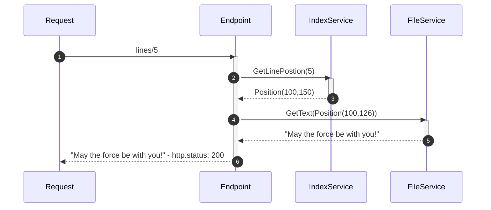

# Line Server
Implementation of a REST API that serves lines from an ASCII file.
A line is delimited with a newline (`\n`).

## Prerequisites
You need [NET6 SDK](https://dotnet.microsoft.com/en-us/download)
installed in your system.

## Usage

### Run
    # example if file is in the root of the repository
    $ run.sh ../../my-text-file.txt
    
    # or you can use dotnet cli
    $ dotnet run --project src/Presentation.Api -- ../../my-text-file.txt

### Build
    # restores all required packages and builds the project
    $ build.sh

    # or you can use dotnet cli
    $ dotnet build

### Run tests
    $ dotnet test

## How does the system work
### Assumptions
* Each line is terminated with a newline ("\n").
* Any given line will fit into memory.
* The line is valid ASCII (e.g. not Unicode).

### Limitations
The implementation will work while the number of lines in the file are lower 
or equal to `int.MaxValue` that is _2 147 483 647_. This is related
to the data structure used to create the index.
The number of concurrent requests will be limited by the number of file handles 
the OS supports.

### Design
The solution was designed to be fast and optimize the resource (_RAM_, _CPU_) usage.

To achieve that it was accepted, depending on the file size and number of
lines, the service would take a bit of time to be ready to serve requests.
This is required to create an in-memory index that will be used to access
the right position of the line in the file.

#### Building the Index
Index is built by opening the file and then scanning it for _newline_ char,
when it founds one will add it to a _Linked List_. If we find more than
`int.MaxValue` lines we will stop build the index and application will be
terminated with error code 4.

If the index is correctly created the _Linked List_ will be converted to an
_Array_ to ensure we can access any line as fast as possible.

#### Serving a valid request

#### Serving an invalid request
An invalid request is a request that is less than 0 and greater than the
number of lines the file contains. When that happens the API will respond
with a [413 - Content Too Long](https://datatracker.ietf.org/doc/html/rfc9110#section-15.5.14)
status code.

### System Performance
The performance tests were run using release build on my dev boxes:
* Windows 11
  * CPU: I7-11700KB
  * RAM: 32 GB
  * SSD: MSI M390 500GB
* MacBook Pro 16 (2019)
  * CPU: I7
  * RAM: 16 GB
  * SSD: 512 GB

#### Building the index
This will be the operation that is mostly affected by the file size since we need
to traverse the whole file. 

| File Size |     Lines | Memory | Windows 11 |   MacBook |
|----------:|----------:|-------:|-----------:|----------:|
|     10 MB |     10350 |  38 MB |      13 ms |     18 ms |
|    100 MB |    102762 |  43 MB |     196 ms |    203 ms |
|      1 GB |   1024560 |  88 MB |   1 600 ms |  1 910 ms |
|     10 GB |  10262510 | 533 MB |  15 362 ms | 20 286 ms |

#### Requests
Request tests were done using [ali](https://github.com/nakabonne/ali) on both OS.
Benchmark was done over a minute span. Both OS configurations are the default related
to number of file handles that they can handle.

Besides the common bottlenecks of services this has another one that are the number
of file handlers the OS allow to use concurrently. 

    $ ali --duration=1m --rate={concurrentRequests} https://localhost:5001/lines/{lineNumber}

##### Windows 11

| File Size | lineNumber | concurrentRequests |     Mean |      Min |   Max | Errors |
|----------:|-----------:|-------------------:|---------:|---------:|------:|-------:|
|     10 MB |       5000 |                100 | 0.727 ms | 0.937 ms | 25 ms |      0 |
|     10 MB |       5000 |               1000 | 1.568 ms | 1.000 ms | 29 ms |      0 |
|      1 GB |     500000 |                100 | 0.683 ms | 0.508 ms | 36 ms |      0 |
|      1 GB |     500000 |               1000 | 1.651 ms | 0.509 ms | 31 ms |      0 |
|     10 GB |    5000000 |                100 | 0.688 ms | 0.000 ms | 19 ms |      0 |
|     10 GB |    5000000 |               1000 | 1.508 ms | 0.527 ms | 23 ms |      0 |

##### MacBook Pro

| File Size | lineNumber | concurrentRequests |     Mean |      Min |    Max | Errors |
|----------:|-----------:|-------------------:|---------:|---------:|-------:|-------:|
|     10 MB |       5000 |                100 | 1.023 ms | 0.198 ms | 154 ms |      0 |
|     10 MB |       5000 |               1000 | 7.884 ms | 0.037 ms |    1 s |   1738 | 
|      1 GB |     500000 |                100 | 1.373 ms | 0.218 ms | 240 ms |      0 |
|      1 GB |     500000 |               1000 | 7.936 ms | 0.037 ms |    2 s |   1758 |
|     10 GB |    5000000 |                100 | 1.585 ms | 0.267 ms | 279 ms |      0 |
|     10 GB |    5000000 |               1000 | 7.925 ms | 0.038 ms |   2 ms |   1755 |

### Research
Most of the documents used were from [Microsoft technical documentation](https://docs.microsoft.com/en-us/).
[Awesome http benchmark](https://github.com/denji/awesome-http-benchmark) to find a 
simple tool to do some benchmarks in both OS.

### Dependencies
ASP.NET was the choice since is a framework that I like and wanted to test then
new minimal apis.

[System.IO.Abstractions](https://github.com/TestableIO/System.IO.Abstractions) were used
to simplify unit-testing with the file system. .NET doesn't have built in abstractions
to the file system. Used this because it is a mature implementation.

To simplify the test creation two libraries were used, [FakeItEasy](https://github.com/FakeItEasy/FakeItEasy)
and [FluentAssertions](https://github.com/fluentassertions/fluentassertions).
The reasoning is the same for both, simplify the test readability and
implementation.

### Time spent
Around 16h were used to build, test and write the documentation.

If had unlimited time would:
1. Implement authentication and authorization
2. Increment the test coverage
3. Monitoring and traceability
4. Reuse of file handle to eliminate the OS limitation
5. Partition the index to remove the cap on max number of lines
6. Implement a CLI to build the index outside of the api

### Things to better
To early to find something that could do better :D
From the current implementation, without more information the 
only thing should make better would be `NewlineIndexerService.Build`
method that is a bit bigger than I would like.
