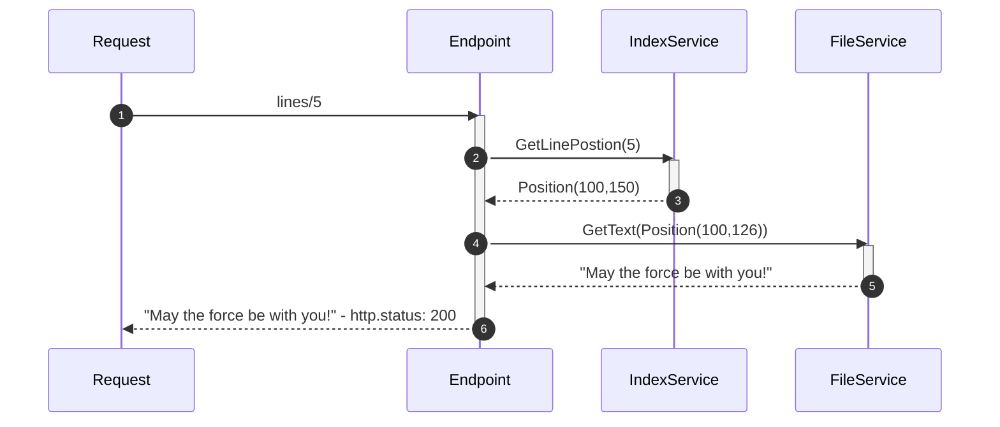

# Line Server
Implementation of a REST API that serves lines from an ASCII file.
A line is delimited with a newline (`\n`).

## Prerequisites
You need [NET6 SDK](https://dotnet.microsoft.com/en-us/download)
installed in your system.

## Usage

### Run
    # example if file is in the root of the repository
    $ run.sh ../../my-text-file.txt
    
    # or you can use dotnet cli
    $ dotnet run --project src/Presentation.Api -- ../../my-text-file.txt

### Build
    # restores all required packages and builds the project
    $ build.sh

    # or you can use dotnet cli
    $ dotnet build

### Run tests
    $ dotnet test

## How does the system work
### Assumptions
* Each line is terminated with a newline ("\n").
* Any given line will fit into memory.
* The line is valid ASCII (e.g. not Unicode).

### Limitations
The implementation will work while the number of lines in the file are lower 
or equal to `int.MaxValue` that is _2 147 483 647_. This is related
to the data structure used to create the index.
The number of concurrent requests will be limited by the number of file handles 
the OS supports.

### Design
The solution was designed to be fast and optimize the resource (_RAM_, _CPU_) usage.

To achieve that it was accepted, depending on the file size and number of
lines, the service would take a bit of time to be ready to serve requests.
This is required to create an in-memory index that will be used to access
the right position of the line in the file.

#### Building the Index
Index is built by opening the file and then scanning it for _newline_ char,
when it founds one will add it to a _Linked List_. If we find more than
`int.MaxValue` lines we will stop build the index and application will be
terminated with error code 4.

If the index is correctly created the _Linked List_ will be converted to an
_Array_ to ensure we can access any line as fast as possible.

#### Serving a valid request

#### Serving an invalid request
An invalid request is a request that is less than 0 and greater than the
number of lines the file contains. When that happens the API will respond
with a [413 - Content Too Long](https://datatracker.ietf.org/doc/html/rfc9110#section-15.5.14)
status code.

### System Performance
The performance tests were run using release build on my dev boxes:
* Windows 11
  * CPU: I7-11700KB
  * RAM: 32 GB
  * SSD: MSI M390 500GB
* MacBook Pro 16 (2019)
  * CPU: I7
  * RAM: 16 GB
  * SSD: 512 GB

#### Building the index
This will be the operation that is mostly affected by the file size since we need
to traverse the whole file. 

| File Size |     Lines | Memory |  Windows 11 |  MacBook |
|----------:|----------:|-------:|------------:|---------:|
|     10 MB |     10350 |  38 MB |      101 ms | 0:05:810 |
|    100 MB |    102762 |  43 MB |     1034 ms | 0:57:546 |
|      1 GB |   1024560 |  87 MB |     8367 ms |       -- |
|     10 GB |  10262510 | 532 MB | 0:01:17.588 |       -- |

#### 